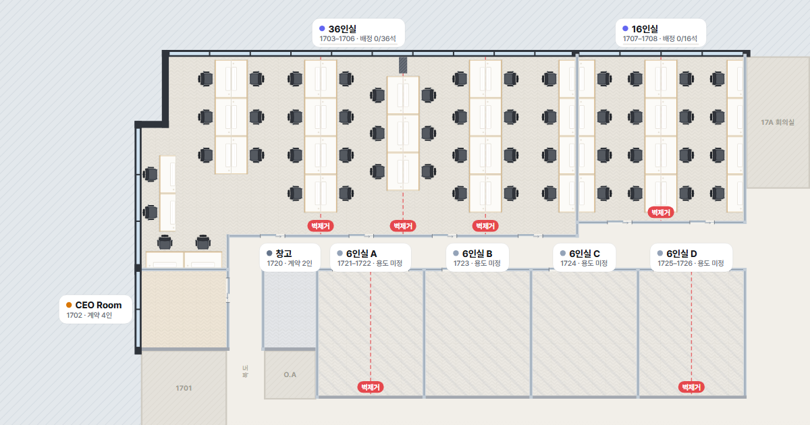

# Inertia 17F 오피스 시뮬레이터

드림플러스 강남 17층 이너시아 전용공간(1702~1708, 1720~1726)의 **자리 배치 시뮬레이터**입니다.
게임의 건축 모드처럼 가구를 골라 배치·회전·이름 지정을 하고, 링크로 회사 사람들과 공유할 수 있습니다.



---

## 1. 배포하기 (GitHub Pages · 처음 한 번만)

git 설치 없이 **웹 브라우저만으로** 할 수 있습니다.

1. https://github.com 에 로그인 → 오른쪽 위 **＋ → New repository**
   - Repository name: 예) `inertia-17f`
   - **Public** 선택 (무료 GitHub Pages는 공개 저장소만 지원) → **Create repository**
2. 새 저장소 화면에서 **uploading an existing file** 링크 클릭
3. 이 폴더(`inertia-17f`) **안의 모든 파일과 폴더**를 브라우저 창에 끌어다 놓기
   - `index.html` 이 저장소 최상위에 오도록 올려야 합니다 (폴더째 한 단계 더 들어가면 안 됨)
   - `.nojekyll` 파일은 숨김 파일이라 안 보일 수 있는데, 없어도 동작합니다
4. 아래 **Commit changes** 클릭
5. 저장소 **Settings → Pages** → Source: **Deploy from a branch** → Branch: **main / (root)** → **Save**
6. 1~2분 뒤 같은 화면 위쪽에 주소가 나타납니다:
   `https://<깃허브아이디>.github.io/inertia-17f/` ← 이 링크를 회사에 공유하면 끝

> 수정한 파일을 다시 올릴 때도 3~4번과 같이 **Add file → Upload files** 로 덮어쓰면 됩니다.
>
> 메신저(슬랙·카카오톡)에 링크를 붙였을 때 미리보기 이미지가 안 뜨면, `index.html` 의
> `og:image` 값을 전체 주소(예: `https://<아이디>.github.io/inertia-17f/assets/og-image.png`)로 바꿔 다시 올리세요.

### 공개 범위 주의
- GitHub Pages 주소는 **링크를 아는 누구나** 열 수 있습니다 (검색 노출은 거의 없지만 비공개는 아님).
- 도면·현장 사진이 포함되어 있고, `layout.json` 을 올리면 그 안의 이름도 공개됩니다.
  실명 대신 영어 이름/닉네임을 쓰거나, 사내 전용 호스팅이 필요하면 IT 담당자와 상의하세요.
- 임대료 등 계약 금액 정보는 사이트에 넣지 않았습니다.

---

## 2. 시나리오 저장 (Firebase)

`js/firebase-config.js` 에 Firebase 설정값이 들어 있으면 시나리오가 **서버에 저장**됩니다.

- 편집 모드에서 **[저장하기]** (`Ctrl+S`) → **시나리오 이름 + 작성자**를 정해 저장.
  열려 있는 시나리오에 **덮어쓰기** 하거나 **새 시나리오로 저장**을 고를 수 있습니다.
- 상단 시나리오 버튼 (`Ctrl+O`) → **시나리오 목록**: 저장된 여러 안을 누구나 열어 볼 수 있습니다.
  - ★ **대표 시나리오**: 사이트를 처음 여는 사람에게 보이는 안 (목록의 ⋯ → 대표 시나리오로 지정)
  - ⋯ 메뉴: 이름·작성자 변경 · **버전 기록** · 사본으로 열기 · 삭제(목록 아래에서 복원 가능)
- 누군가 시나리오를 저장하면, 그 시나리오를 보고 있는 사람 화면에 **바로 반영**됩니다.
  편집 중이던 사람에게는 "새로 저장했어요" 안내가 뜨고 내 작업은 유지됩니다.
- 같은 시나리오를 두 사람이 동시에 고쳐 저장하면 나중 사람에게 **충돌 안내**가 뜨고,
  "새 시나리오로 저장" 또는 "그래도 덮어쓰기"를 고를 수 있습니다.
- 링크만 있으면 누구나 저장할 수 있어서, 안전장치가 있습니다.
  - 덮어쓰기·이름 변경·삭제 직전의 내용이 **버전 기록**에 자동으로 남고, 기록은 서버에서 수정·삭제가 불가능
  - 시나리오는 완전 삭제가 불가능 (목록에서 숨김 → 복원 가능)
- 저장 전 편집 내용은 이 브라우저에 임시 보관되어, 창을 닫았다 열어도 이어서 작업할 수 있습니다.
- 접근 규칙은 `firestore.rules` (Firebase 콘솔 → Firestore Database → 규칙 에 붙여넣고 게시).
- 설정값이 없거나 서버에 연결할 수 없으면 **이 브라우저에만** 저장됩니다.

## 3. 공유하는 방법

| 방법 | 언제 쓰나 | 어떻게 |
|---|---|---|
| **사이트 주소** | 회사 사람들에게 처음 알릴 때 | ★ 대표 시나리오가 열리고, 목록에서 다른 안도 볼 수 있음 |
| **시나리오 링크** | "2안 봐 주세요" 처럼 특정 안을 보여줄 때 | **공유 → 이 시나리오 링크**. 다시 저장되면 링크도 항상 최신 |
| **스냅샷 링크** | 저장 안 한 상태 그대로 잠깐 보여줄 때 | **공유 → 지금 화면 그대로**. 링크 안에 배치가 통째로 들어 있음 |
| **PNG 이미지** | 메신저·보고서에 붙일 때 | **⋯ → PNG 이미지로 저장** |

---|---|---|
| **공유 링크** | "이 배치안 어때요?" 하고 바로 보여줄 때 | 오른쪽 위 **공유 → 복사**. 링크 안에 배치가 통째로 들어 있어 서버 저장이 필요 없음 |
| **공식 배치 게시** | 회사 링크 첫 화면을 확정안으로 바꿀 때 | **공유 → layout.json 내려받기** → 저장소에 업로드(덮어쓰기). 이후 모든 사람의 기본 화면이 바뀜 |
| **PNG 이미지** | 메신저·보고서에 붙일 때 | **⋯ → PNG 이미지로 저장** |

- 각자의 편집 내용은 **각자 브라우저에만 자동 저장**됩니다. 다른 사람의 화면은 바뀌지 않습니다.
- 공식 배치가 새로 게시되면, 아직 손대지 않은 사람은 자동으로 새 배치를 보고,
  직접 편집한 적이 있는 사람에게는 "새 공식 배치안" 알림이 뜹니다.

---

## 4. 사용법

### 보기 모드 (기본)
- 상단 검색창에 이름 입력 → 해당 자리로 이동 (`/` 키)
- 공간·자리 클릭 → 오른쪽에 정보, 현장 사진
- 왼쪽 **구성원** 탭: 이름/팀 목록, **빈 자리** 강조, 팀별 강조

### 편집 모드 (건축 모드)
- 왼쪽 **아이템** 탭에서 카드를 도면으로 **끌어다 놓기** 또는 **클릭 후 도면 클릭**
  - 배치 중 `R` 회전, `Shift`+클릭 연속 배치, `Esc` 취소
  - "책상 배치 시 의자 함께 놓기" 켜면 책상+의자가 한 세트(그룹)로 배치
- 선택한 아이템: 드래그 이동 · 모서리 핸들로 크기 조절 · 위쪽 동그란 핸들로 회전
- 오른쪽 패널: **이름**(예: 댄) · 팀 · 메모 · 크기 · 색상 · 잠금
- **책상 위 소품**(모니터·노트북·서류 뭉치·조명·전화기·소형 화분)과 **박스**는 책상·테이블·랙 위에 올려 두면
  책상 방향에 맞춰 자동 회전되고, 책상·랙을 옮기거나 돌리거나 지우면 함께 따라갑니다 (겹침 경고 없음)
- 빈 공간 클릭 → **프리셋**(업무실 벽면형/벤치형, 회의실, 라운지, 집중업무실, CEO 집무실, 창고 선반 등)
- 여러 개 선택(드래그 영역 / Shift+클릭) → 정렬·분배, **이름 일괄 입력**, 팀 일괄 지정
- **사용자 아이템 만들기**: 이름·모양·크기·색을 정해 원하는 물건을 만들고 '내 아이템'에 저장
- **[저장하기]** 로 시나리오 이름·작성자를 붙여 저장, 상단 시나리오 버튼으로 여러 안을 불러오기
- 겹침/벽 충돌은 빨간 점선으로 표시, 이동 중에는 주변까지 거리(cm)가 표시됨

### 단축키
| 동작 | 키 |
|---|---|
| 회전 90° / 미세 회전 | `R` · `Shift+R` / `[` `]` |
| 복제 / 복사·붙여넣기 / 삭제 | `Ctrl+D` / `Ctrl+C` `Ctrl+V` / `Delete` |
| 실행 취소 / 다시 실행 | `Ctrl+Z` / `Ctrl+Shift+Z` |
| 그룹 / 그룹 해제 / 잠금 | `Ctrl+G` / `Ctrl+Shift+G` / `L` |
| 미세 이동 | 방향키 (1cm, `Shift` 10cm) |
| 화면 이동 / 전체 보기 / 측정 | `Space`+드래그 · 우클릭 드래그 / `F` / `M` |
| 스냅 없이 이동 | `Alt`+드래그 |

---

## 5. 도면 데이터 출처와 수정

| 공간 | 호실 | 계약 | 치수 (cm) | 출처 |
|---|---|---|---|---|
| 36인실 | 1703~1706 (벽 3개소 제거) | 36인 | 1590 × 650 | 세로: 엑셀 실측 / 가로: 평면도 비율 추정 |
| 16인실 | 1707~1708 (벽 1개소 제거) | 16인 | 603 × 600 | 세로: 엑셀 실측 / 가로: 평면도 비율 추정 |
| CEO Room | 1702 | 4인 | 310 × 280 | 엑셀 실측 |
| 창고 | 1720 | 2인 | 186 × 280 | 엑셀 실측 |
| 6인실 A~D | 1721~1722 · 1723 · 1724 · 1725~1726 | 각 6인 | 380 × 456 | 엑셀 실측 |

- 36인·16인실의 기존 책상·의자 배치는 「드림플러스 엑셀도안」의 36인/16인 시트를 그대로 옮겼습니다 (책상 1,400 × 600).
- 출입문 위치는 평면도에 없어 **추정**입니다. 편집 모드에서 문 선택 → 잠금 해제 → 이동하면 됩니다.
- 실측해서 치수를 바꾸려면 `js/plan.js` 의 `ROOMS` → `poly` 좌표(cm)를 수정하세요.

---

## 6. 파일 구조

```
index.html            화면 구조
css/app.css           디자인
js/sprites.js         가구 에셋 라이브러리 (탑뷰 SVG, 크기에 맞춰 그려짐)
js/plan.js            도면 · 기본 배치 · 프리셋 데이터
js/app.js             시뮬레이터 엔진 (편집·저장·공유)
js/sync.js            시나리오 서버 저장소 (Firebase Firestore)
js/firebase-config.js Firebase 설정값
firestore.rules       Firestore 보안 규칙 (콘솔에 붙여넣기)
js/selftest.js        개발용 자가 점검 (index.html?selftest 로 실행)
assets/               로고, 현장 사진, 원본 평면도, 미리보기 이미지
layout.json           (선택) 공식 배치 — 올리면 모두의 기본 화면이 됨
```

빌드 과정 없이 정적 파일만으로 동작합니다. PC에서 `index.html` 을 더블클릭해도 열리지만,
공유 링크는 배포된 주소에서 만들어야 다른 사람이 열 수 있습니다.
